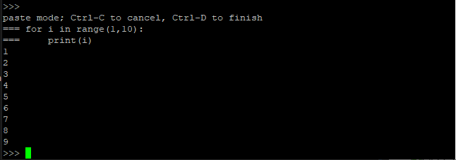
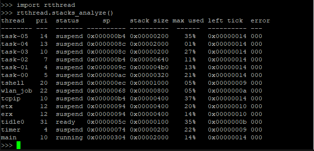

# 使用 MicroPython 控制硬件

## 简介

MicroPython 是 Python 3 编程语言的一种精简而高效的实现，它包含 Python 标准库的一个子集，并被优化为在微控制器和受限环境中运行。它具有交互式提示、任意精度整数、闭包函数、列表解析、生成器、异常处理等高级特性，具有很强的可移植性。它能够帮助开发者快速控制各种硬件外设，不用再去研究底层硬件模块的使用方法，翻看寄存器手册。降低了开发难度，而且减少了重复开发工作，可以加快开发速度，提高开发效率。

本例程作将介绍如何在 rt-thread 上使用 MicroPython ，并通过命令行展示 MicroPython 代码的输入与运行，最后使用一个示例，演示使用 MicroPython 控制硬件。

## 硬件说明

本例程将点亮LED灯，因此请确保硬件平台上的LED灯能够正常工作。

## 软件说明

main 程序代码位于 `examples/02_micropython/applications/main.c` 中, 主要是为 MicroPython 的提供必要的运行环境。

在 main 函数中，主要完成以下几个任务：

- 创建 MTD 设备

- 挂载 LittleFS 文件系统

- 打开 MicroPython 命令交互界面

main 函数代码如下所示

```c
int main(void)
{
    struct rt_device *flash_dev;

    /* 配置 wifi 工作模式 */
    rt_wlan_set_mode(RT_WLAN_DEVICE_STA_NAME, RT_WLAN_STATION);
    rt_wlan_set_mode(RT_WLAN_DEVICE_AP_NAME, RT_WLAN_AP);

    /* 初始化分区表 */
    fal_init();

    /* 在 fs_part 分区上创建一个 MTD 设备 */
    flash_dev = fal_mtd_nor_device_create(FS_PARTITION_NAME);
    if (flash_dev == NULL)
    {
        LOG_E("Can't create a mtd device on '%s' partition.\n", FS_PARTITION_NAME);
    }

    /* 挂载 LittleFS 文件系统 */
    if (dfs_mount(FS_PARTITION_NAME, "/", "lfs", 0, 0) == 0)
    {
        LOG_I("Filesystem initialized!\n");
    }
    else
    {
        /* 创建 LittleFS 文件系统 */
        dfs_mkfs("lfs", FS_PARTITION_NAME);
        /* 再次挂载 LittleFS 文件系统 */
        if (dfs_mount(FS_PARTITION_NAME, "/", "lfs", 0, 0) != 0)
        {
            LOG_E("Failed to initialize filesystem!");
        }
    }

    /* 打开 MicroPython 命令交互界面 */
    extern void mpy_main(const char *filename);
    mpy_main(NULL);

    LOG_D("MicroPython will reset by user");
    rt_hw_cpu_reset();
    return 0;
}
```

## 运行

### 编译&下载

- **MDK**：双击 `project.uvprojx` 打开 MDK5 工程，执行编译。
- **IAR**：双击 `project.eww` 打开 IAR 工程，执行编译。

编译完成后，将固件下载至开发板。

### 运行效果

在 PC 端使用终端工具打开开发板的 `uart0` 串口，设置 115200 8 1 N 。正常运行后，终端输出信息如下：

```shell
 \ | /
- RT -     Thread Operating System
 / | \     4.0.0 build Feb 15 2019
 2006 - 2018 Copyright by rt-thread team
lwIP-2.0.2 initialized!
[5] I/SAL_SOC: Socket Abstraction Layer initialize success.
[73] I/WLAN.dev: wlan init success
[108] I/WLAN.lwip: eth device init ok name:w0
[113] I/WLAN.dev: wlan init success
[148] I/WLAN.lwip: eth device init ok name:w1
[D/FAL] (fal_flash_init:63) Flash device | nor_flash | addr: 0x00000000 | len: 0x00100000 | blk_size: 0x00001000 |initialized finish.
[I/FAL] ==================== FAL partition table ====================
[I/FAL] | name      | flash_dev |   offset   |    length  |
[I/FAL] -------------------------------------------------------------
[I/FAL] | app       | nor_flash | 0x00010000 | 0x00080000 |
[I/FAL] | download  | nor_flash | 0x00090000 | 0x00060000 |
[I/FAL] | fs_part   | nor_flash | 0x000f0000 | 0x0000b000 |
[I/FAL] | easyflash | nor_flash | 0x000fb000 | 0x00001000 |
[I/FAL] =============================================================
[I/FAL] RT-Thread Flash Abstraction Layer (V0.3.0) initialize success.
[I/FAL] The FAL MTD NOR device (fs_part) created successfully
[235] I/main: Filesystem initialized!

MicroPython v1.10 on 2019-02-13; Universal python platform with RT-Thread
Type "help()" for more information.
>>>
```

此时 MicroPython 命令交互界面就已经启动，可以通过命令行与 MicroPython 进行交互。下面将使用一个示例展示如何使用 MicroPython 控制硬件。

## MicroPython 基本功能

### Python 语法与内建函数

#### 使用 python 交互命令行

- MicroPython 是 Python 3 编程语言的一种精简而高效的实现，语法和 Python 3 相同，并带有丰富的内建函数，使用 MicroPython 交互命令行即可运行 Python 代码。

在交互命令行输入 `print('hello RT-Thread!')` ，然后输入回车，将运行这行语句，在下一行输出 hello RT-Thread! 字样。运行效果如下：


#### 交互命令行的粘贴模式

`MicroPython`  比一般的 python 交互环境多了一个特别的**粘贴模式**，可以一次粘贴输入多行 python 代码。

- 按下 `Ctrl-E` 组合键，进入粘贴模式，界面上会出现提示：`paste mode; Ctrl-C to cancel, Ctrl-D to finish` 。该模式下可一次粘贴多行代码。

- 按下 `Ctlr-D` 组合键，退出粘贴模式。同时粘贴输入的代码也会自动执行。

- 按下 `Ctrl-C` 组合键，终止正在执行的程序。

> 注意：进入粘贴模式后，不要使用 `Ctrl-C` 粘贴代码。可使用鼠标右键进行粘贴。

使用粘贴模式执行下面代码：

```python
for i in range(1,10):
    print(i)
```

执行效果如下：



#### MicroPython 内建模块

MicroPython 提供丰富的内建模块用来完成相关的程序功能。同时 RT-Thread  也提供了 `rtthread` 模块用来返回系统运行相关的信息。

- 使用 `rtthread` 模块查看当前运行线程，调用方法及效果如下图所示：



- 使用 `time` 模块进行毫秒延时，调用方法及效果如下图所示：


### MicroPython 例程

通过 MicroPython 可以用非常简单的方式来控制开发板的硬件资源，使用一个简单的例子来说明：

- W600 开发板中: 第 23 号 pin 为 蓝色 LED 灯。下面代码将周期闪烁 LED 灯。

```python
import time
from machine import Pin

LED = Pin(("LED1", 23), Pin.OUT_PP)     #将第 23 号 Pin 设备设置为输出模式
while True:
    LED.value(1)
    time.sleep_ms(500)
    LED.value(0)
    time.sleep_ms(500)
```

针对自己的开发板修改引脚号，将以上脚本使用**粘贴模式**输入，即可看到 LED 灯按照指定的频率闪烁。使用 `Ctrl-C` 可以取消当前正在运行程序。

## 注意事项

- 想要了解更多的 MicroPython 软件包的功能，可以查阅 MicroPython 用户手册。

## 引用参考

《RT-Thread 编程指南》: docs/RT-Thread 编程指南.pdf

《MicroPython用户手册》: docs/UM1011-RT-Thread-MicroPython 用户手册
